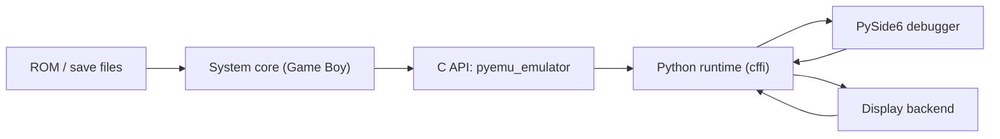

# Architecture

This project has four layers.

## 1. Native emulator handle

The public C API lives in:
- [native/include/pyemu/core/emulator.h](E:/projects/pyemu/native/include/pyemu/core/emulator.h)

`pyemu_emulator` is the stable handle used by Python and any future native frontends. It owns:
- the selected system instance
- the coarse run state (`STOPPED`, `PAUSED`, `RUNNING`)

The implementation lives in:
- [native/src/core/emulator.c](E:/projects/pyemu/native/src/core/emulator.c)

Important responsibilities:
- system registration and lookup
- forwarding API calls into the selected system vtable
- returning zero/default structs when no system is active

## 2. System abstraction

The system contract lives in:
- [native/include/pyemu/core/system.h](E:/projects/pyemu/native/include/pyemu/core/system.h)

Every core implements a `pyemu_system_vtable` with these categories:
- lifecycle: `reset`, `destroy`, `load_rom`, save/load state
- execution: `step_instruction`, `step_frame`
- inspection: CPU state, frame buffer, memory, cartridge/debug info
- status: ROM loaded, cycle count, fault state

This is the main extension seam for adding new consoles.

## 3. System implementation

The current reference implementation is the refactored Game Boy core:
- [native/include/pyemu/systems/gameboy/gameboy_system.h](E:/projects/pyemu/native/include/pyemu/systems/gameboy/gameboy_system.h)
- [native/src/systems/gameboy/gameboy_internal.h](E:/projects/pyemu/native/src/systems/gameboy/gameboy_internal.h)

The intended baseline shape for a mature core is:
- [native/src/systems/gameboy/gameboy_system.c](E:/projects/pyemu/native/src/systems/gameboy/gameboy_system.c)
  - top-level orchestration
  - remaining execution/block-cache glue
  - vtable wiring
- [native/src/systems/gameboy/memory.c](E:/projects/pyemu/native/src/systems/gameboy/memory.c)
  - memory map
  - bus access tracking
  - CPU-visible reads/writes
  - DMA / IO side effects
- [native/src/systems/gameboy/state.c](E:/projects/pyemu/native/src/systems/gameboy/state.c)
  - reset/post-boot state
  - ROM loading
  - save/load state serialization
- [native/src/systems/gameboy/mapper.c](E:/projects/pyemu/native/src/systems/gameboy/mapper.c)
  - cartridge type handling
  - ROM/RAM bank selection
  - battery-backed save RAM
- [native/src/systems/gameboy/ppu.c](E:/projects/pyemu/native/src/systems/gameboy/ppu.c)
  - LCD timing
  - STAT/VBlank behavior
  - scanline rendering
- [native/src/systems/gameboy/apu.c](E:/projects/pyemu/native/src/systems/gameboy/apu.c)
  - audio channels
  - mixing
  - audio debug export
- [native/src/systems/gameboy/input.c](E:/projects/pyemu/native/src/systems/gameboy/input.c)
  - joypad/input state
  - input-triggered interrupts
- [native/src/systems/gameboy/cpu_helpers.c](E:/projects/pyemu/native/src/systems/gameboy/cpu_helpers.c)
  - register helpers
  - flags
  - arithmetic and bit operations
- [native/src/systems/gameboy/cpu_core.c](E:/projects/pyemu/native/src/systems/gameboy/cpu_core.c)
  - fetch/push/pop
  - interrupt service
- [native/src/systems/gameboy/cpu_exec.c](E:/projects/pyemu/native/src/systems/gameboy/cpu_exec.c)
  - opcode-family dispatchers
  - CB-prefixed execution

This is the architecture new cores should copy.

Not every new core needs the exact same file names, but the separation of concerns should stay similar:
- one thin system entry file
- one private internal header
- subsystem modules for memory, state, video, audio, input, and CPU logic

That keeps the core maintainable and makes it much easier to evolve multiple systems in parallel.

Commenting standard for baseline cores:
- each subsystem file should start with a short module comment
- each non-trivial helper should have a concise contract comment explaining what state it owns or mutates
- the goal is that someone drafting another core can understand which function to copy, adapt, or leave alone without reverse engineering it first

## 4. Python runtime and UI

The Python-facing runtime lives in:
- [python/pyemu/runtime.py](E:/projects/pyemu/python/pyemu/runtime.py)

It is responsible for:
- selecting and loading the native DLL
- exposing a Pythonic `Emulator` wrapper
- normalizing ROM paths, zip extraction, and state paths
- surfacing CPU, memory, frame, and cartridge info to the UI

The debugger UI lives in:
- [python/pyemu/app.py](E:/projects/pyemu/python/pyemu/app.py)

Display backends live in:
- [python/pyemu/display.py](E:/projects/pyemu/python/pyemu/display.py)

The UI should stay generic. It should depend on:
- `SystemInfo`
- `Emulator`
- generic CPU/frame/memory/debug access

and avoid hardcoding Game Boy-specific assumptions whenever possible.

## Data flow

## Current extension points

If we add another system, these are the intended seams:
- register a new system key in [native/src/core/emulator.c](E:/projects/pyemu/native/src/core/emulator.c)
- implement a new `pyemu_system_vtable`
- add a `SystemInfo` entry in [python/pyemu/runtime.py](E:/projects/pyemu/python/pyemu/runtime.py)
- keep the UI generic and only add system-specific panels when necessary

## Baseline for new cores

The Game Boy core is now the baseline template for new systems.

When drafting another core, aim for this progression:

1. Create a system directory under `native/src/systems/<system>/`
2. Add:
   - `<system>_system.c`
   - `<system>_internal.h`
3. Split responsibilities early instead of waiting for a monolith:
   - `memory.c`
   - `state.c`
   - `ppu.c` or equivalent video module
   - `apu.c` or equivalent audio module
   - `input.c`
   - CPU support files if the system is CPU-driven in the same style
4. Keep `<system>_system.c` as the thinnest file practical

The goal is not cosmetic file splitting. The goal is:
- easier debugging
- smaller merge conflicts
- easier onboarding
- a repeatable pattern across multiple consoles

## What is intentionally generic today

- emulator creation by system key
- run/pause/step surface
- frame buffer transport
- memory snapshots
- save/load state plumbing
- trace and rewind in the Python layer

## What is still Game Boy-specific

- joypad helper in the public C API
- cartridge/debug interpretation
- most hardware panels in the debugger
- the actual native implementation

Those are the next areas to generalize as more cores mature.
