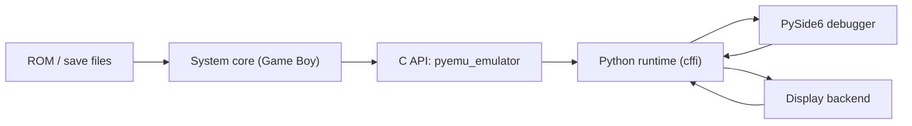

# Architecture

This project has four layers.

## 1. Native emulator handle

The public C API lives in:
- [native/include/pyemu/core/emulator.h](E:/projects/pyemu/native/include/pyemu/core/emulator.h)

`pyemu_emulator` is the stable handle used by Python and any future native frontends. It owns:
- the selected system instance
- the coarse run state (`STOPPED`, `PAUSED`, `RUNNING`)

The implementation lives in:
- [native/src/core/emulator.c](E:/projects/pyemu/native/src/core/emulator.c)

Important responsibilities:
- system registration and lookup
- forwarding API calls into the selected system vtable
- returning zero/default structs when no system is active

## 2. System abstraction

The system contract lives in:
- [native/include/pyemu/core/system.h](E:/projects/pyemu/native/include/pyemu/core/system.h)

Every core implements a `pyemu_system_vtable` with these categories:
- lifecycle: `reset`, `destroy`, `load_rom`, save/load state
- execution: `step_instruction`, `step_frame`
- inspection: CPU state, frame buffer, memory, cartridge/debug info
- status: ROM loaded, cycle count, fault state

This is the main extension seam for adding new consoles.

## 3. System implementation

The current Game Boy core lives in:
- [native/include/pyemu/systems/gameboy/gameboy_system.h](E:/projects/pyemu/native/include/pyemu/systems/gameboy/gameboy_system.h)
- [native/src/systems/gameboy/gameboy_system.c](E:/projects/pyemu/native/src/systems/gameboy/gameboy_system.c)

The Game Boy file currently contains:
- CPU execution
- bus and mapper handling
- timers and interrupts
- LCD/scanline logic
- save state serialization
- debugger-oriented inspection hooks

It is large today because we optimized for momentum while building compatibility. If we add more systems, the next cleanup step should be splitting reusable helpers from Game Boy-specific logic.

## 4. Python runtime and UI

The Python-facing runtime lives in:
- [python/pyemu/runtime.py](E:/projects/pyemu/python/pyemu/runtime.py)

It is responsible for:
- selecting and loading the native DLL
- exposing a Pythonic `Emulator` wrapper
- normalizing ROM paths, zip extraction, and state paths
- surfacing CPU, memory, frame, and cartridge info to the UI

The debugger UI lives in:
- [python/pyemu/app.py](E:/projects/pyemu/python/pyemu/app.py)

Display backends live in:
- [python/pyemu/display.py](E:/projects/pyemu/python/pyemu/display.py)

The UI should stay generic. It should depend on:
- `SystemInfo`
- `Emulator`
- generic CPU/frame/memory/debug access

and avoid hardcoding Game Boy-specific assumptions whenever possible.

## Data flow

## Current extension points

If we add another system, these are the intended seams:
- register a new system key in [native/src/core/emulator.c](E:/projects/pyemu/native/src/core/emulator.c)
- implement a new `pyemu_system_vtable`
- add a `SystemInfo` entry in [python/pyemu/runtime.py](E:/projects/pyemu/python/pyemu/runtime.py)
- keep the UI generic and only add system-specific panels when necessary

## What is intentionally generic today

- emulator creation by system key
- run/pause/step surface
- frame buffer transport
- memory snapshots
- save/load state plumbing
- trace and rewind in the Python layer

## What is still Game Boy-specific

- joypad helper in the public C API
- cartridge/debug interpretation
- most hardware panels in the debugger
- the actual native implementation

Those are good candidates for refactoring once we start a second real core.
